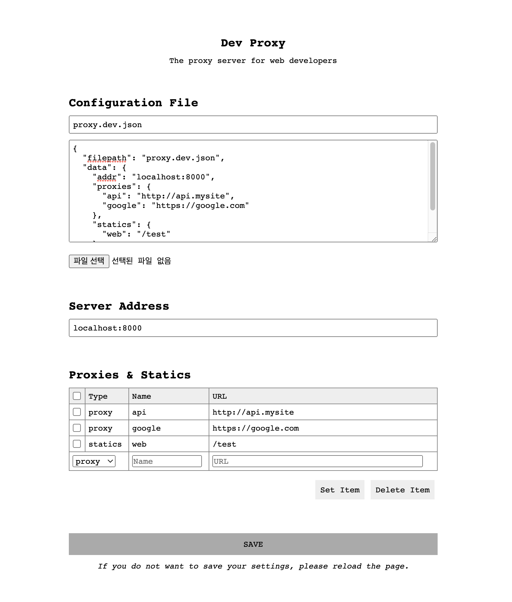

# Dev Proxy Server
A solution that addresses security issues like CORS during the development phase by specifying the origin of both front-end and back-end servers or external API servers as the same place.

# Usage
[Manual(English)](https://github.com/yejun614/dev-proxy/wiki/Manual(English)) | [매뉴얼(한국어)](https://github.com/yejun614/dev-proxy/wiki/Manual(%ED%95%9C%EA%B5%AD%EC%96%B4))
1. Download dev-proxy for your platform ([v2 release](https://github.com/yejun614/dev-proxy/releases/tag/v2.0.0))
2. Just run it!

# Admin page
Please access **/dev-proxy/admin**


# Issues
- If you encounter any bugs, issues, or questions while using the software, please register on our [Issues page](https://github.com/yejun614/dev-proxy/issues) on Github.

# Contributions
- We really appreciate people who want to contribute to open source software.
- After you fork your repository, add or remove new features or fix bugs, then request a merge.

# LICENSE
```
MIT License

Copyright (c) 2023 YeJun, Jung

Permission is hereby granted, free of charge, to any person obtaining a copy
of this software and associated documentation files (the "Software"), to deal
in the Software without restriction, including without limitation the rights
to use, copy, modify, merge, publish, distribute, sublicense, and/or sell
copies of the Software, and to permit persons to whom the Software is
furnished to do so, subject to the following conditions:

The above copyright notice and this permission notice shall be included in all
copies or substantial portions of the Software.

THE SOFTWARE IS PROVIDED "AS IS", WITHOUT WARRANTY OF ANY KIND, EXPRESS OR
IMPLIED, INCLUDING BUT NOT LIMITED TO THE WARRANTIES OF MERCHANTABILITY,
FITNESS FOR A PARTICULAR PURPOSE AND NONINFRINGEMENT. IN NO EVENT SHALL THE
AUTHORS OR COPYRIGHT HOLDERS BE LIABLE FOR ANY CLAIM, DAMAGES OR OTHER
LIABILITY, WHETHER IN AN ACTION OF CONTRACT, TORT OR OTHERWISE, ARISING FROM,
OUT OF OR IN CONNECTION WITH THE SOFTWARE OR THE USE OR OTHER DEALINGS IN THE
SOFTWARE.
```